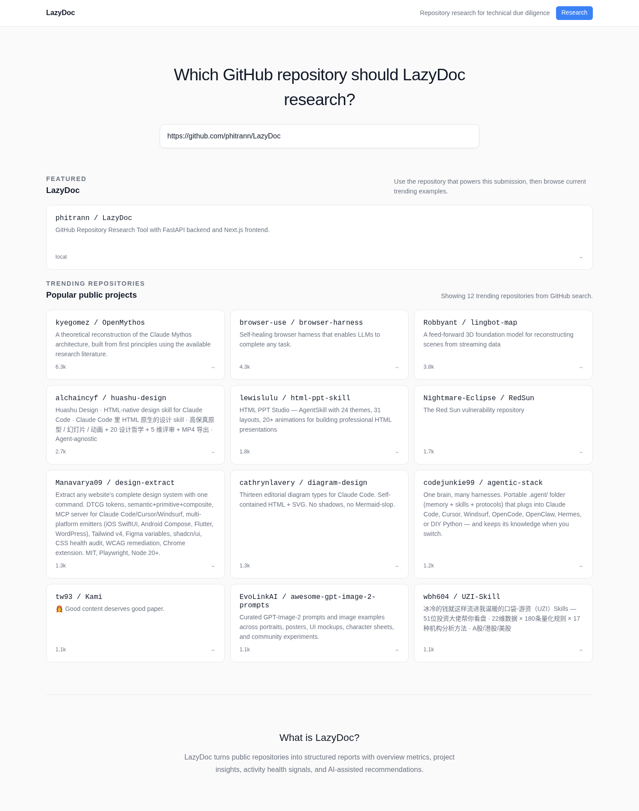
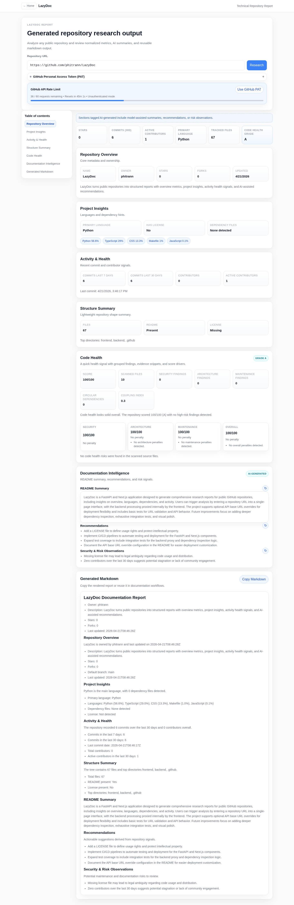
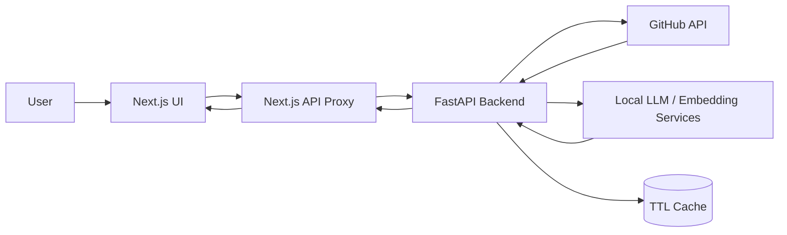

# LazyDoc

**Instantly generate AI-powered technical reports for any GitHub repository.**

LazyDoc is an intelligent repository analysis engine that transforms any public GitHub URL into a comprehensive technical report. Get instant insights on code health, architecture, documentation quality, and more—without reading thousands of lines of code.


The current application includes:
- **Repository Overview** – Stars, forks, license, age, and key metadata at a glance
- **Code Health Scoring** – Heuristic analysis for security risks, code patterns, and architecture signals
- **Activity & Trends** – Commit frequency, contributor velocity, and project momentum
- **Project Structure** – Directory analysis, language breakdown, and dependency detection
- **AI-Generated Insights** – Recommendations and risk observations powered by LLMs
- **README Intelligence** – Automatic README summarization and documentation analysis
- **Rate-Limit Visibility** – GitHub API quota tracking with authenticated PAT support
- **Live Report Regeneration** – Stream individual sections for real-time report updates

## Screenshots

### Landing page



### Report page



## How it works

LazyDoc runs a multi-stage analysis pipeline on any public GitHub repository:

1. **URL Input** – Paste a GitHub repository URL on the landing page
2. **Repository Fetch** – Pull metadata, commit history, contributors, and code samples
3. **Code Analysis** – Scan for security patterns, architecture signals, and code health metrics
4. **AI Enrichment** – Generate insights, recommendations, and risk observations
5. **Report Generation** – Compile findings into a readable, sectioned technical report
6. **Stream & Share** – View live results, regenerate specific sections, and export as markdown

Perfect for due diligence, technical hiring, dependency evaluation, or quick repository assessment.

## Use Cases

- 🔍 **Tech Due Diligence** – Evaluate open-source dependencies before integrating them
- 💼 **Technical Hiring** – Assess candidate projects and code health during interviews
- 📊 **Repository Benchmarking** – Compare similar projects across code quality and activity
- 🛡️ **Security Assessment** – Identify potential risks and antipatterns in unfamiliar codebases
- 📚 **Documentation Review** – Get quick summaries of large or poorly-documented projects
- 🚀 **Startup Evaluation** – Analyze early-stage open-source projects for potential

## Feature summary

### Core Analysis
- Repository Overview
- Project Insights
- Activity & Health
- Structure Summary
- Code Health Scoring
- Documentation Intelligence
- Generated Markdown

### UX & Reliability
- PAT input with authenticated GitHub forwarding
- Rate-limit banner with remaining quota and reset timing
- Partial-success warnings and normalized backend error payloads
- In-memory TTL caching on the backend
- Targeted AI section regeneration for readme summary, recommendations, and risk observations
- Streaming README-summary tokens during regeneration
- Markdown rendering for generated content
- Copy markdown action for reuse in documentation workflows
- Landing page trending repository feed with fallback content

## Requirement coverage

| Exercise requirement | Status | Notes |
| --- | --- | --- |
| Input field for public GitHub repository URL | Complete | Available on landing and report pages. |
| Research button to trigger analysis | Complete | Main entry action in both views. |
| Clean, readable report | Complete | Sectioned layout, sticky TOC, cards, warnings, and markdown rendering. |
| Repository overview | Complete | Name, owner, description, stars, forks, updated timestamp, and repo URL. |
| Main programming languages | Complete | Primary language and language percentage tags. |
| Dependency overview | Complete (heuristic) | Detects common dependency manifests. |
| Project structure summary | Complete | File count, README/license presence, top directories. |
| Recent commits and activity | Complete | 7-day and 30-day commit counts, contributor activity. |
| Contributor overview | Complete | Total and active contributors. |
| License detection | Complete | License presence and SPDX identifier when available. |
| Security or risk observations | Complete | AI-generated risk observations plus code-health findings. |
| README summarization | Complete | README fetched from GitHub and summarized with fallback behavior. |
| AI-generated insights/recommendations | Complete | AI-assisted recommendations and section regeneration. |
| Edge-case handling | Complete | Invalid URL, not found, rate limit, timeout, and upstream-fallback states. |
| Performance considerations | Partial | In-memory TTL cache and request dedupe are implemented; no persistent cache or background queue yet. |

## Architecture at a glance



- The frontend owns the user experience, navigation, markdown rendering, and PAT input.
- The backend owns URL validation, GitHub ingestion, normalization, caching, code-health analysis, and AI-enriched report generation.
- Next.js proxy routes keep browser requests simple and make one-port demo deployment easier.

## Backend services

- `backend/app/api/research.py`
  Research endpoint for normalized repository analysis.
- `backend/app/api/documentation.py`
  Documentation endpoint and streaming endpoint for AI section updates.
- `backend/app/services/github_client.py`
  GitHub API client with PAT-aware headers and rate-limit extraction.
- `backend/app/services/repo_analyzer.py`
  Normalizes GitHub data into overview, insights, activity, structure, and `code_health`.
- `backend/app/services/documentation_generator.py`
  Produces README summary, AI recommendations, risk observations, sections, and markdown.
- `backend/app/services/code_health.py`
  Heuristic source-code scanner for security, architecture, and maintenance findings.

## Code-health scope today

The current code-health feature is intentionally heuristic and optimized for exercise value rather than full static-analysis precision.

It currently includes:
- Secret-like literal detection
- Dynamic execution and shell-execution heuristics
- Debug statement and TODO detection
- Basic Python and JS/TS internal import graph extraction
- Coupling, cycle, and orphan-file signals
- Score breakdown plus A-F grade

Known limitations:
- It samples a limited subset of source files
- It does not parse full language ASTs
- Findings are heuristic and should be treated as advisory, not authoritative security results

## Getting Started

### Try Online (No Setup Required)
Visit the live deployment at: **[LazyDoc on Vercel](https://frontend-5qv42b9ls-foxxyhcmus-projects.vercel.app)**

### Run Locally

**Prerequisites:** Python 3.9+, Node.js 18+

```bash
# Clone the repository
git clone https://github.com/phitrann/LazyDoc.git
cd LazyDoc

# Install dependencies and start backend
cd backend
pip install -r requirements.txt
uvicorn app.main:app --reload --port 8992

# In another terminal, start frontend
cd ../frontend
npm install
npm run dev
```

Visit `http://localhost:3000` and paste a GitHub URL to generate a report.

### Deploy to Vercel

```bash
# Deploy backend
cd backend
vercel deploy --prod

# Deploy frontend
cd ../frontend
BACKEND_URL="<your-backend-url>" # From previous step
echo "$BACKEND_URL" | vercel env add BACKEND_INTERNAL_URL production
vercel deploy --prod
```

See [docs/DEPLOYMENT.md](docs/DEPLOYMENT.md) for detailed deployment steps.

## Environment variables

### Backend

- `GITHUB_TOKEN`
  Optional default GitHub token when no UI PAT is provided.
- `GITHUB_TIMEOUT_SECONDS`
  GitHub request timeout. Default: `15`
- `CACHE_TTL_SECONDS`
  TTL for the in-memory cache. Default: `1800`
- `ENABLE_LONG_CACHE`
  Enables longer-lived cache entries when supported elsewhere in the stack. Default: `false`
- `LONG_CACHE_TTL_SECONDS`
  Long cache TTL. Default: `86400`
- `GITHUB_USER_AGENT`
  GitHub client user agent string. Default: `AutoDocResearchTool/1.0`
- `GITHUB_API_BASE_URL`
  GitHub API base URL. Default: `https://api.github.com`
- `LOCAL_LLM_BASE_URL`
  Local or OpenAI-compatible LLM endpoint. Default: `http://localhost:8001/v1`
- `LOCAL_EMBEDDING_BASE_URL`
  Local or OpenAI-compatible embedding endpoint. Default: `http://localhost:8002/v1`
- `LOCAL_LLM_MODEL`
  LLM model name. Default: `Qwen/Qwen3.5-4B`
- `LOCAL_EMBEDDING_MODEL`
  Embedding model name. Default: `BAAI/bge-m3`
- `OPENAI_API_KEY`
  API key for OpenAI-compatible clients. Default: `not_used`

### Frontend

- `NEXT_PUBLIC_API_BASE_URL`
  Optional API base override. Leave empty to use the built-in Next.js proxy routes.
- `BACKEND_INTERNAL_URL`
  URL the Next.js server uses to reach FastAPI. Default: `http://127.0.0.1:8992`

## API notes

### `POST /api/research`

Returns normalized repository data:
- `overview`
- `insights`
- `activity`
- `structure`
- optional `code_health`
- optional `warnings`
- optional `rate_limit`

### `POST /api/documentation`

Returns the research payload plus:
- `sections`
- `markdown`
- `readme_summary`
- `recommendations`
- `risk_observations`

Supports:
- `force_regenerate`
- `ai_section` with `all`, `readme_summary`, `recommendations`, or `risk_observations`
- optional `X-GitHub-Token`

### `POST /api/documentation/stream`

Streams staged AI updates for documentation generation and targeted section regeneration.

### `GET /api/trending`

Returns a featured repository plus trending public repositories for the landing page, with fallback data when the GitHub search call is unavailable.

## Testing and verification

Current repository checks include:
- URL validation tests
- Documentation generator regression tests
- Repo analyzer normalization tests
- Code-health analyzer tests
- API endpoint tests for research and documentation routes
- Frontend production build verification

Examples:

```bash
pytest -q backend/tests/test_documentation_generator.py
pytest -q backend/tests/test_repo_analyzer.py
pytest -q backend/tests/test_code_health.py
pytest -q backend/tests/test_api.py
npm --prefix frontend run build
```

## Design decisions

- FastAPI + Next.js was chosen to keep backend normalization and frontend UX concerns cleanly separated.
- The report API returns frontend-friendly blocks instead of raw GitHub payloads.
- The GitHub PAT is handled per request so the report can surface better rate-limit behavior without requiring global configuration.
- Cache entries are separated by auth context so authenticated requests do not accidentally reuse anonymous results.
- Code-health analysis is intentionally heuristic and lightweight to fit the exercise scope.

## AI usage

AI tools were used to accelerate planning, implementation scaffolding, UI iteration, and documentation drafting. The final behavior and trade-offs were still validated against the exercise requirements and revised through local testing.

## What I would improve with more time

### Exercise-facing improvements
- Add one end-to-end smoke test that exercises the happy-path report flow from API to UI.
- Improve the report copy so partial-data and fallback states are even easier to interpret during demo review.
- Parse common dependency manifests for richer dependency summaries instead of filename-based hints only.

### Production-facing improvements
- Move from in-memory TTL caching to a persistent shared cache such as Redis.
- Run code-health and documentation jobs asynchronously with background workers and request IDs.
- Expand code-health analysis with AST-based rules, suppressions, and analyzer versioning.
- Add structured telemetry for GitHub errors, model fallbacks, and response timings.
