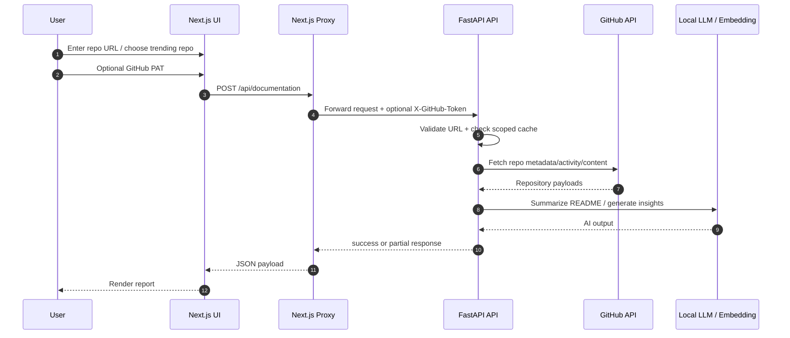
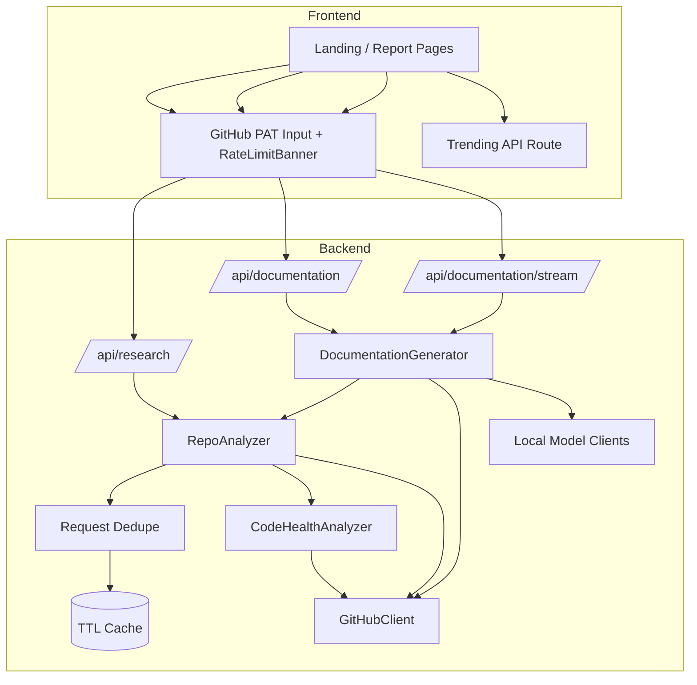

# Project Documentation

## 1. Overview

LazyDoc is a GitHub Repository Research Tool built for the technical exercise in `docs/GTLC Technical Exercise - GitHub Repository.pdf`. The application accepts a public GitHub repository URL and produces a structured technical report with normalized repository metadata, AI-assisted documentation insights, and heuristic code-health findings.

Current stack:
- Backend: FastAPI on Python 3.11+
- Frontend: Next.js 14 with TypeScript
- Styling: custom CSS
- AI integration: OpenAI-compatible local LLM and embedding endpoints

Primary user flow:
1. User lands on the home page and chooses a featured or trending repository, or pastes a GitHub URL manually.
2. User optionally provides a GitHub PAT on the report page.
3. Frontend sends the request through a Next.js proxy route.
4. FastAPI validates the URL and fetches GitHub data.
5. `RepoAnalyzer` normalizes repository metadata and `CodeHealthAnalyzer` builds heuristic code-health output.
6. `DocumentationGenerator` produces README summary, recommendations, risk observations, sections, and markdown.
7. Frontend renders the report and can selectively regenerate AI sections via the streaming endpoint.

---

## 2. Current Feature Set

### Report content
- Repository Overview
- Project Insights
- Activity & Health
- Structure Summary
- Code Health
- Documentation Intelligence
- Generated Markdown

### UX and platform features
- PAT input with pass-through `X-GitHub-Token`
- Rate-limit banner sourced from the most recent GitHub response
- Trending repository cards on the landing page
- Markdown rendering for README summary and generated markdown
- Copy markdown action
- Warnings for partial-success responses
- Streamed regeneration of individual AI sections
- In-memory TTL cache and request dedupe on the backend

### Current bonus coverage relative to the exercise
- License detection
- README summarization
- AI-generated recommendations and risk observations
- Security- and architecture-oriented code-health findings
- Edge-case handling for invalid URLs, missing repositories, rate limits, timeouts, and upstream failures

### UI recommendations for the next iteration
- Add lightweight provenance badges so evaluators can immediately distinguish GitHub-derived metrics, AI-generated insights, and heuristic code-health findings.
- Add a compact top-level report summary row that surfaces the single most important repository signals before the user scrolls.
- Add a rendered/raw toggle for the markdown block so the output is both readable and easy to reuse.
- Refine mobile treatment of the code-health findings to reduce density and improve scanability on smaller screens.
- Add clearer empty-state language for sparse repositories with no README, low activity, or limited dependency hints.

---

## 3. System Design

The system uses a thin-frontend / normalized-backend design:
- Next.js handles presentation, navigation, browser interactions, and proxy routing.
- FastAPI handles repository validation, GitHub ingestion, normalization, AI orchestration, and cache-backed report generation.
- GitHub remains the system of record for repository metadata and content.
- Local or OpenAI-compatible model services enrich the report with AI-generated sections.

### 3.1 High-level request flow



### 3.2 Backend composition



### 3.3 Why the current structure works

- The proxy routes simplify browser-side networking and public demo deployment.
- `RepoAnalyzer` and `DocumentationGenerator` remain separate so normalized analysis can be reused by both research and documentation endpoints.
- `CodeHealthAnalyzer` stays isolated from core metrics, which keeps its heuristic behavior clearly bounded.
- Cache keys are now separated by auth context:
  - anonymous requests share one cache scope
  - PAT-backed requests share a different cache scope
- This avoids serving anonymously cached GitHub results to a PAT-backed request while still keeping the implementation simple for public repositories.

---

## 4. Caching, Auth, and AI Regeneration

### 4.1 Cache behavior

The backend uses an in-memory TTL cache for normalized analysis and documentation outputs.

Current behavior:
- `RepoAnalyzer` caches by repository + auth context
- `DocumentationGenerator` caches by repository + auth context
- Concurrent analyzer requests for the same scoped key are deduplicated

Auth scopes:
- `anonymous`
- `authenticated`

The raw PAT is never used directly in cache keys.

### 4.2 PAT behavior

- The user can provide a PAT in the report UI.
- Next.js forwards the token to FastAPI through `X-GitHub-Token`.
- FastAPI forwards the token to `GitHubClient` on a per-request basis.
- The most recent GitHub rate-limit headers are surfaced back to the frontend as `rate_limit`.

### 4.3 Targeted AI regeneration

The documentation flow supports regenerating:
- `readme_summary`
- `recommendations`
- `risk_observations`

Important current behavior:
- A targeted refresh with `force_regenerate=true` refreshes the base analysis first, then regenerates only the requested AI section.
- The streaming endpoint does not emit an early full-report `complete` event before the targeted section is finished.
- Updated sections rebuild the markdown and section list from the refreshed base report.

---

## 5. Code Health Design

### 5.1 What is implemented today

`CodeHealthAnalyzer` scans a bounded subset of source files and produces:
- score
- grade
- summary
- breakdown
- finding list
- high-level metrics such as coupling and circular dependency counts

Implemented rule families:
- Potential hardcoded secrets
- Suspicious credential literals
- Dynamic execution
- Shell execution
- Debug statements
- TODO/FIXME markers
- Import-graph-based architecture signals

### 5.2 Python import handling

The current implementation resolves:
- absolute imports such as `from app.utils import x`
- parent-relative imports such as `from ..utils import x`
- `from package import module` when the imported name is a real submodule

This matters because the import graph drives:
- coupling index
- cycle detection
- architecture findings

### 5.3 Current limitations

- It is heuristic rather than AST-accurate
- It scans a sample of source files rather than the entire repository
- It is best used as a lightweight signal for the exercise, not as a full static-analysis or security-scanning replacement

---

## 6. API Shape

### `POST /api/research`

Returns:

```json
{
  "status": "success",
  "data": {
    "overview": {},
    "insights": {},
    "activity": {},
    "structure": {},
    "code_health": {}
  },
  "warnings": [],
  "rate_limit": {}
}
```

### `POST /api/documentation`

Returns:

```json
{
  "status": "success",
  "data": {
    "overview": {},
    "insights": {},
    "activity": {},
    "structure": {},
    "code_health": {},
    "sections": [],
    "markdown": "# ...",
    "readme_summary": "...",
    "recommendations": [],
    "risk_observations": []
  },
  "warnings": [],
  "rate_limit": {}
}
```

### `POST /api/documentation/stream`

SSE events include:
- `stage`
- `token`
- `ai_update`
- `complete`
- `error`
- final `done`

### Common error codes
- `INVALID_URL`
- `REPOSITORY_NOT_FOUND`
- `RATE_LIMIT_EXCEEDED`
- `GITHUB_TIMEOUT`
- `GITHUB_UNAVAILABLE`
- `GITHUB_ERROR`
- `UPSTREAM_UNAVAILABLE`

---

## 7. Run Instructions

### Backend

```bash
cd backend
python -m venv .venv
source .venv/bin/activate
pip install -r requirements.txt
uvicorn app.main:app --reload --host 0.0.0.0 --port 8992
```

### Frontend

```bash
cd frontend
npm install
npm run dev
```

### Useful root shortcuts

```bash
make install
make backend
make frontend
make dev
make test
make build-frontend
```

### Important environment variables

Backend:
- `GITHUB_TOKEN`
- `GITHUB_TIMEOUT_SECONDS`
- `CACHE_TTL_SECONDS`
- `ENABLE_LONG_CACHE`
- `LONG_CACHE_TTL_SECONDS`
- `GITHUB_USER_AGENT`
- `GITHUB_API_BASE_URL`
- `LOCAL_LLM_BASE_URL`
- `LOCAL_EMBEDDING_BASE_URL`
- `LOCAL_LLM_MODEL`
- `LOCAL_EMBEDDING_MODEL`
- `OPENAI_API_KEY`

Frontend:
- `NEXT_PUBLIC_API_BASE_URL`
- `BACKEND_INTERNAL_URL=http://127.0.0.1:8992`

---

## 8. Testing Status

Current checks cover:
- URL parsing and validation
- Documentation generator behavior and fallback handling
- Repo analyzer normalization behavior
- Code-health scoring and import-resolution regression cases
- API route behavior for research and documentation endpoints
- Frontend production build

Recommended verification commands:

```bash
pytest -q backend/tests/test_documentation_generator.py
pytest -q backend/tests/test_repo_analyzer.py
pytest -q backend/tests/test_code_health.py
pytest -q backend/tests/test_api.py
npm --prefix frontend run build
```

---

## 9. Design Decisions and Trade-offs

### Key decisions
- Prefer normalized response objects over raw GitHub payloads
- Keep PAT usage optional and per-request
- Use lightweight heuristics for code health to fit exercise scope
- Support targeted AI refresh for better UX without rebuilding the whole page state
- Use one-port demo-friendly proxy routing

### Trade-offs
- In-memory cache is simple but not persistent
- Dependency analysis is still shallow and mostly manifest-based
- Code-health analysis trades precision for speed and simplicity
- The AI layer relies on external model availability and therefore includes deterministic fallback paths

---

## 10. AI Usage

AI assistance was used for:
- planning and implementation acceleration
- UI iteration and layout refinement
- documentation drafting
- regression-fix reasoning and test design

The project was still validated against the exercise rubric and adjusted through local code inspection, tests, and build verification.

---

## 11. Screenshots

Fresh screenshots for the current UI are stored in `docs/screenshots/`:

### Landing page


### Report page


---

## 12. Next Improvements

### Exercise-facing polish
- Add a lightweight end-to-end smoke test for the main report flow
- Make partial-data/fallback messaging more explicit in the UI
- Deepen dependency summaries by reading common manifest contents instead of only detecting file names
- Add provenance markers and a compact summary ribbon to improve two-minute evaluator scanability

### Production-facing hardening
- Move cache storage to Redis or another shared persistent store
- Add background jobs for longer-running AI and analysis tasks
- Introduce analyzer versioning and result provenance
- Expand code-health analysis with AST-aware rules, suppressions, and richer language coverage
