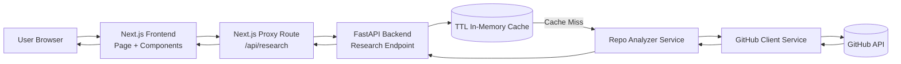

# Project Documentation

## 1. Overview

This project is a GitHub Repository Research Tool built for a technical exercise.
It accepts a public GitHub repository URL and generates a structured, readable report.

Default stack:
- Backend: FastAPI (Python 3.11+)
- Frontend: Next.js (TypeScript)

Core user flow:
1. User inputs a GitHub repository URL.
2. User clicks Research.
3. Backend fetches and analyzes repository data via GitHub API.
4. Frontend renders report sections and warnings/errors when needed.

---

## 2. Implemented Features

### Core features
- URL input field and Research button.
- Backend endpoint to analyze a public repository.
- Report rendering with these sections:
  - Repository Overview
  - Project Insights
  - Activity and Health
  - Structure Summary

### Reliability and UX
- Friendly error states for invalid URL, not found, and rate-limited scenarios.
- Warning state for partial data results.
- In-memory TTL cache to reduce repeated API calls.
- Responsive report layout and clear metric cards.

---

## 3. System Design (with Visualization)

The system is designed as a thin UI + API orchestration layer:
- Next.js serves the user interface and exposes a proxy API route.
- FastAPI handles repository validation, ingestion, analysis, and normalization.
- GitHub API is the only external data source.
- A small in-memory TTL cache avoids repeated upstream calls for the same repository.

Data flow:
1. User submits repository URL in the frontend.
2. Frontend calls Next.js API route (`/api/research`).
3. Next.js proxy forwards request to FastAPI backend.
4. FastAPI validates URL, checks cache, then calls GitHub API (if needed).
5. Backend analyzer builds normalized report sections.
6. Frontend renders report with success/partial/error states.



---

## 4. Stack Decision

Chosen stack:
- Backend: FastAPI (Python 3.11+)
- Frontend: Next.js with TypeScript
- Styling: CSS-based modular layout (MVP-first)

Why this stack:
1. FastAPI gives fast API development with strong typing and clear schema patterns.
2. Python is efficient for data ingestion/transformation tasks and easy to iterate during exercises.
3. Next.js provides quick UI delivery, built-in API routes, and simple local-to-public demo workflows.
4. TypeScript improves frontend reliability and readability for handoff/review.

Alternative options considered:
- Node/Express backend:
  - Pros: single-language stack.
  - Cons: less ergonomic for rapid data-processing in this specific exercise context.
- Single frontend-only app calling GitHub directly:
  - Pros: less infrastructure.
  - Cons: weaker control over normalization, caching, and error mapping.

Decision trade-offs:
- Two services add setup overhead, but provide clearer separation of responsibilities.
- In-memory cache is simple and demo-friendly, but not persistent across restarts.

---

## 5. Architecture

## Backend (FastAPI)
Key modules:
- `backend/app/api/research.py`: API route for research requests.
- `backend/app/services/github_client.py`: GitHub API integration layer.
- `backend/app/services/repo_analyzer.py`: Normalizes raw API data into report sections.
- `backend/app/utils/url_validator.py`: Parses and validates repository URLs.
- `backend/app/core/cache.py`: In-memory TTL cache.
- `backend/app/core/config.py`: Environment-based settings.

Primary endpoint:
- `POST /api/research`
  - Input: `{ "repository_url": "https://github.com/owner/repo" }`
  - Output: `success` or `partial` response with report data, or `error` response with code/message.

## Frontend (Next.js)
Key modules:
- `frontend/src/app/page.tsx`: Main page, form, and report rendering.
- `frontend/src/lib/api.ts`: Frontend API client.
- `frontend/src/app/api/research/route.ts`: Proxy route to backend for single-URL public demos.
- `frontend/src/components/*`: Reusable report and status UI components.

Public demo strategy:
- Expose only frontend port publicly.
- Next.js proxy forwards `/api/research` to backend internally.

---

## 6. API Response Shape

Success/partial:
```json
{
  "status": "success",
  "data": {
    "overview": { "name": "...", "owner": "..." },
    "insights": { "primary_language": "..." },
    "activity": { "recent_commits_last_7_days": 0 },
    "structure": { "total_files": 0 }
  },
  "warnings": []
}
```

Error:
```json
{
  "status": "error",
  "error_code": "INVALID_URL",
  "message": "Repository URL must be in the form https://github.com/owner/repo."
}
```

Common error codes:
- `INVALID_URL`
- `REPOSITORY_NOT_FOUND`
- `RATE_LIMIT_EXCEEDED`
- `GITHUB_TIMEOUT`
- `GITHUB_UNAVAILABLE`
- `UPSTREAM_UNAVAILABLE`

---

## 7. Setup and Run

## Backend
```bash
cd backend
python -m venv .venv
source .venv/bin/activate
pip install -r requirements.txt
uvicorn app.main:app --reload --host 0.0.0.0 --port 8000
```

## Frontend
```bash
cd frontend
npm install
npm run dev
```

Important notes:
- Use `npm run dev` (not `npm dev`).
- If backend runs on a custom port, set `BACKEND_INTERNAL_URL` in `frontend/.env.local`.

---

## 8. Public Demo Options

## Option A: ngrok
```bash
ngrok http 3000
```
If you get `ERR_NGROK_4018`, add your authtoken once:
```bash
ngrok config add-authtoken YOUR_TOKEN_HERE
ngrok http 3000
```

## Option B: LocalTunnel
```bash
npx localtunnel --port 3000
```

## Option C: Cloudflare Quick Tunnel
```bash
cloudflared tunnel --url http://localhost:3000
```

---

## 9. Testing

Current test coverage includes:
- URL parser validation tests.
- Analyzer normalization/caching behavior tests.
- API endpoint behavior tests for success/error cases.

Run tests from repository root:
```bash
pytest
```

---

## 10. Design Decisions and Trade-offs

Key decisions:
- Start with MVP-first architecture, then iterate.
- Keep backend response normalized for frontend simplicity.
- Use in-memory cache for speed and low setup complexity.
- Use frontend proxy route to simplify public demos.

Trade-offs:
- Dependency analysis is intentionally shallow.
- Cache is not persistent across restarts.
- Single-page frontend flow favors speed over advanced navigation.

---

## 11. AI Tooling Usage

AI assistance was used for:
- Planning and phase breakdown.
- Project scaffolding and boilerplate acceleration.
- Drafting implementation and documentation structure.

Final solution decisions were constrained by exercise requirements and kept intentionally simple-first.

---

## 12. Next Iterations

If more time is available:
1. Add deeper dependency inspection.
2. Add richer README summarization.
3. Add optional AI recommendations with explicit confidence and fallbacks.
4. Add stronger integration and end-to-end test coverage.
5. Introduce persistent caching (for example Redis) behind a feature flag.
